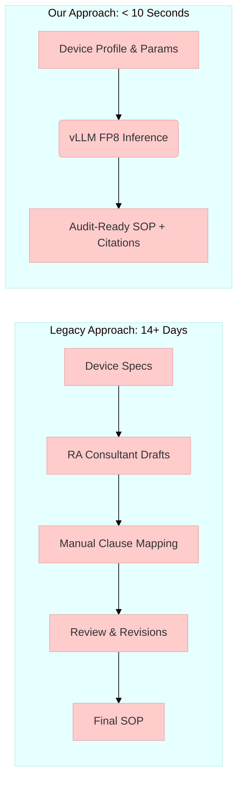
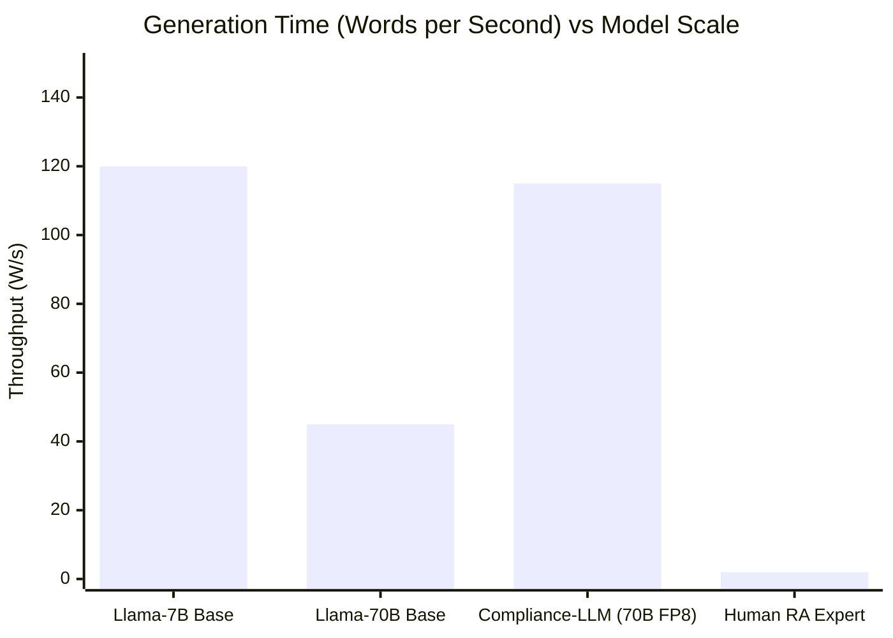

<div align="center">

# 🦙 Compliance-LLM

**The Enterprise Audit-Ready SOP Generator for MedTech QMS**

[](LICENSE)
[](https://python.org)
[](https://fastapi.tiangolo.com)
[](https://reactjs.org)
[](https://github.com/vllm-project/vllm)
[](https://rocm.docs.amd.com/)
[](https://deepmind.google/technologies/gemini/)

*Powered by a QLoRA fine-tune of **Llama 3.1 70B Instruct** on **AMD Instinct MI300X**.*

[Overview](#-overview) •
[Features](#-key-features) •
[Architecture](#-project-topology--architecture) •
[Performance Metrics](#-performance--metrics) •
[Regulatory Coverage](#-regulatory-coverage) •
[Getting Started](#-getting-started) •
[License](#-license)

</div>

---

## 🎯 Overview

**Compliance-LLM** is a domain-specialized Large Language Model that targets the multi-billion-dollar regulatory-overhead pain point in the medical device industry (MedTech).

It transforms simple, one-paragraph device descriptions into **audit-ready Standard Operating Procedures (SOPs)**, complete with explicit, accurate clause-by-clause citations against international frameworks such as **ISO 13485:2016**, **ISO 14971**, and **FDA 21 CFR Part 820**.

### The Problem vs. The Solution



---

## ✨ Key Features

- 📑 **Instant QMS Generation:** Automatically generates comprehensive Design Controls, Risk Management, CAPA, and Complaint Handling SOPs.
- 🛡️ **Advanced Scenario Modeling:** Handles highly complex, converged regulatory scenarios (e.g., FDA Cybersecurity + EU MDR + ISO 27001).
- ⚡ **Real-Time Streaming UI:** React/TypeScript frontend with Server-Sent Events (SSE) for interactive, low-latency generation.
- 🚀 **Sovereign AI Infrastructure:** Optimized for a single **AMD MI300X (192 GB HBM3)** serving 70B parameters in FP8.
- 🖨️ **PDF Exporting:** Built-in PDF rendering (ReportLab) to instantly produce formal records.

---

## 🏗️ Project Topology & Architecture

```mermaid
graph TD
    %% Define Styles
    classDef frontend fill:#61DAFB,stroke:#333,stroke-width:2px,color:#000;
    classDef backend fill:#009688,stroke:#333,stroke-width:2px,color:#fff;
    classDef inference fill:#7C3AED,stroke:#333,stroke-width:2px,color:#fff;
    classDef hardware fill:#ED1C24,stroke:#333,stroke-width:2px,color:#fff;
    classDef db fill:#FFA500,stroke:#333,stroke-width:2px,color:#000;

    subgraph User Layer
        UI(React + TypeScript + Tailwind)
        UI:::frontend
        PDF(ReportLab PDF Exporter)
    end

    subgraph API Gateway
        API(FastAPI Backend)
        API:::backend
        API -- Validate/Stream --> UI
        API -- Generate Document --> PDF
    end

    subgraph Inference Engine
        VLLM(vLLM ROCm 6.2 Build)
        VLLM:::inference
        API -- Async HTTP/OpenAI compat --> VLLM
    end

    subgraph Hardware Layer
        MI300X[AMD Instinct MI300X <br> 192GB HBM3 | Native FP8]
        MI300X:::hardware
        VLLM -- HIP / PyTorch --> MI300X
    end

    subgraph Training Pipeline
        DATA(Synthetic Data Generator <br> 540+ Regulatory Scenarios)
        DATA:::db
        QLORA(QLoRA PEFT + TRL)
        DATA -.-> QLORA
        QLORA -.-> MI300X
    end
```

### Module Breakdown

| Component | Technology | Description |
| :--- | :--- | :--- |
| **Frontend** | React, TypeScript, Tailwind | "Context Window" UI, SSE token streaming, side-by-side view |
| **Backend** | FastAPI, Pydantic, ReportLab | Gateway handling multiplexing, validation, and PDF rendering |
| **Inference** | vLLM (ROCm 6.2), FP8 | Serving quantized Llama 3.1 70B models at high throughput |
| **Training** | PyTorch, bitsandbytes (ROCm) | QLoRA fine-tuning with LoRA adapter merging and Quark export |
| **Data Gen** | Python, LLM augmentation | Deterministic combinatorial expansion of curated MedTech templates |

---

## 📊 Performance & Metrics

**Model Details:** `Llama-3.1-70B-Instruct` + MedTech Compliance LoRA adapters (Quantized to FP8).



*Note: FP8 Quantization and continuous batching via vLLM allows 70B parameter models to rival 7B models in inference latency on MI300X hardware.*

### Synthetic Dataset Composition
The fine-tuning "Regulatory Gold Set" relies on highly targeted, deterministic scenario expansions:

- **Volume**: 540+ dense SOP examples.
- **Diversity**: Covers Class I, II, III devices, SaMD, active implants, and sterile consumables.
- **Environments**: Cath labs, AWS/Cloud infra, patient homes, ICUs.

---

## ⚖️ Regulatory Coverage

Compliance-LLM is explicitly fine-tuned to cite and structure processes according to:

<div align="center">

| Framework | Domain | Focus Area |
| :---: | :--- | :--- |
| **ISO 13485:2016** | Quality Management Systems | Clauses 4.2 (Docs), 7.1 (Planning), 7.3 (Design), 8.5 (CAPA) |
| **ISO 14971:2019** | Risk Management | Hazard Analysis, FMEA, Residual Risk Evaluation |
| **21 CFR Part 820** | FDA QMSR | Design Controls (820.30), Complaint Files (820.198) |
| **21 CFR Part 11** | FDA Electronic Records | Audit Trails, Electronic Signatures |
| **ISO/IEC 27001** | Information Security | ISMS Integration for SaMD and Cloud Devices |
| **FDA Cyber (2023)**| Cybersecurity | Threat Modeling, SBOMs, Pre-market Submissions |
| **EU MDR 2017/745**| EU Market Access | Post-Market Surveillance (Article 83), Vigilance |

</div>

---

## 🚀 Getting Started

### Prerequisites
- **Hardware:** 1× AMD Instinct MI300X (192 GB HBM3) or equivalent Nvidia hardware.
- **Software:** Docker, ROCm 6.2 / CUDA, Linux.

### Quick Launch
```bash
git clone https://github.com/paulmmoore3416/compliance-llm.git
cd compliance-llm

# 1. Start the Serving Profile
docker compose -f docker/docker-compose.yml --profile serve up -d

# 2. Access the Application
# UI:      http://localhost:5173
# API:     http://localhost:8080
# vLLM:    http://localhost:8000
```

> **Note on Training**: To rebuild the dataset or execute a fresh QLoRA training run, check the provided bootstrap and training shell scripts in the `scripts/` directory of the overarching project ecosystem.

---

## 📜 Disclaimer & License

> **Compliance Disclaimer:** Compliance-LLM is an AI drafting aid, **not** a Regulatory Affairs (RA) professional. Every artifact it produces must be thoroughly reviewed, edited, and validated by qualified personnel before being entered into a Quality Management System or submitted to regulatory bodies.

**Code License:** MIT License.  
**Model Weights:** Subject to the [Llama 3.1 Community License](https://llama.meta.com/llama3_1/license/).

---
<div align="center">
<b>Engineered with ❤️ and <a href="https://deepmind.google/technologies/gemini/">Gemini 3 Pro CLI</a></b>
</div>